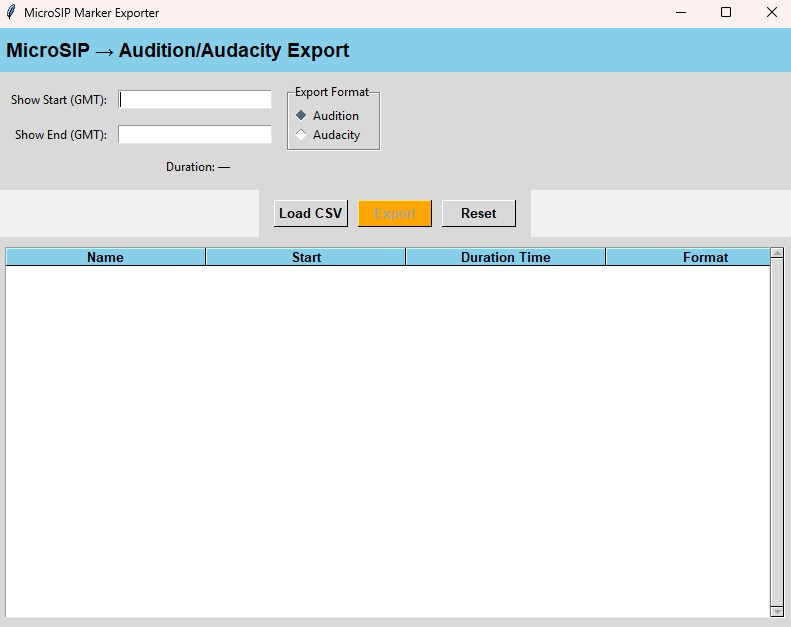

**Download (Windows EXE):** See the latest on the [Releases](../../releases) page.


# Stamppy — MicroSIP → Audition / Audacity Exporter

Stamppy converts MicroSIP call logs (CSV) into marker/label files so you can
jump straight to answered calls during editing. It supports **Adobe Audition**
(marker CSV) and **Audacity** (label TXT). The app provides a simple GUI.

> TIP: Your show start/end times should be entered in **UTC/GMT**. Stamppy will
filter calls that were answered within that time window.

## Features
- Read MicroSIP call log CSV
- Filter for answered calls (incoming, outgoing, voicemail) in a UTC window
- Export:
  - Adobe Audition marker file (tab-delimited `.csv`)
  - Audacity label track (tab-delimited `.txt`)
- Simple Windows GUI



## Download (Windows EXE)
Grab the latest `.exe` from **Releases** on GitHub. No Python required.

## Run from Source (Python 3.11+)
1. Install Python from https://python.org (ensure "tcl/tk and IDLE" is selected so `tkinter` is available).
2. Install dependencies:
   ```bash
   pip install -r requirements.txt
   ```
3. Run:
   ```bash
   python stamppy.py
   ```

## Build a Standalone EXE (PyInstaller)
From the project root:
```bash
pip install pyinstaller
pyinstaller --noconfirm --onefile --windowed --icon "Stamppy.ico" stamppy.py
```
Your EXE will be in `dist/`. Attach this file to a **GitHub Release** instead of committing it.

## Usage (Quick)
1. **Load CSV**: Choose your MicroSIP call log CSV.
2. **Set UTC Window**: Enter show start and end in UTC (e.g., 01:00 to 03:00).
3. **Export**: Select `Audition (.csv)` or `Audacity (.txt)` and save.

## Requirements
- Windows 10/11 (for EXE)
- Python 3.11+ (if running from source)
- Packages: `pandas`, `pytz`, `Pillow` (see `requirements.txt`)

## Notes
- `tkinter` is part of the standard Python installer on Windows. If you get a Tk import error, re-run the installer and choose **Modify** → enable **tcl/tk and IDLE**.
- Do **not** commit build artifacts (`dist/`, `build/`, `*.spec`, `.exe`). Use **.gitignore** and **Releases**.
- Consider renaming your main file to `stamppy.py` and the folder to `stamppy/` (no spaces) for clarity.

## License

Stamppy is licensed under the **Creative Commons Attribution-NonCommercial 4.0** license.

What this means in plain English:
- You can use Stamppy for personal or professional work.
- You can monetize content you create with it (e.g., shows, podcasts).
- You cannot sell Stamppy itself, rebrand it, or package it into a commercial product.

Full license: https://creativecommons.org/licenses/by-nc/4.0/

## License (Original Text)

Stamppy is released under the **Creative Commons Attribution-NonCommercial 4.0 International License (CC BY-NC 4.0)**.

- You can use Stamppy for personal and professional work.
- You can monetize the content you create with Stamppy (e.g., shows, podcasts, edited audio).
- You cannot sell Stamppy itself or package it as part of a commercial product.

Full license: https://creativecommons.org/licenses/by-nc/4.0/
